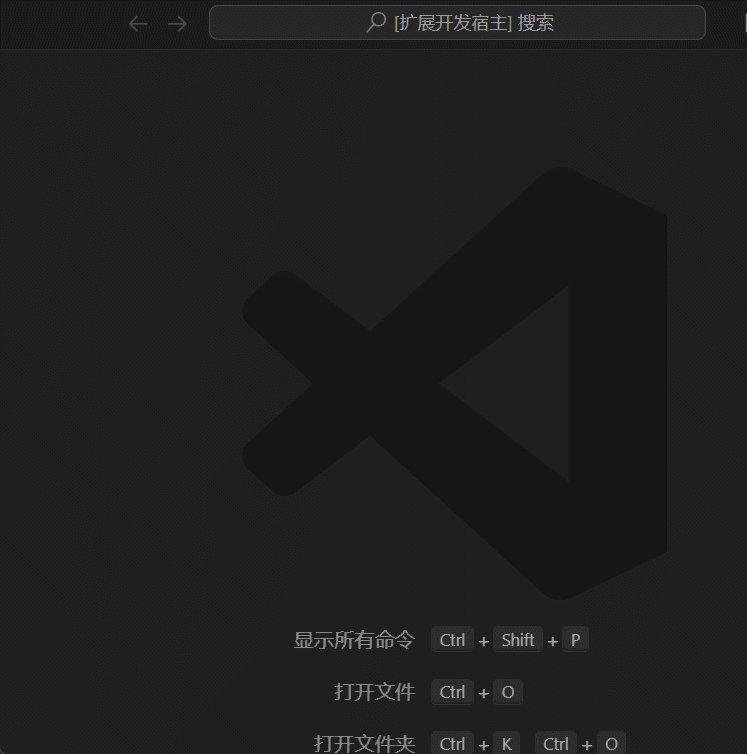

<h1 align="center">
 RSS Search Blog
</h1>

  将VScode变成你的私人RSS阅读器 🐱

## 💡 演示

## 📸 安装

[VSCode Plugin Market](https://marketplace.visualstudio.com/items?itemName=isolcat.isolcat)

## 🎛 使用说明

**Mac** `Control + Shift + P`

**Win** `Shift + Alt + P`
**输入searchBlog来添加需要订阅的RSS**